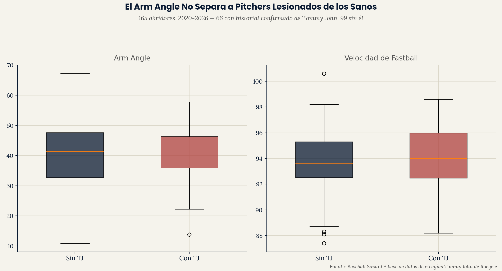

# Elbow Injury Risk — Validación Empírica

**[wheeler-workload-fatigue-study](https://github.com/ejimenezperformance/wheeler-workload-fatigue-study)
construyó un proxy de torque de codo basado en literatura, usando solo
arm angle, estimando que el rediseño mecánico de Wheeler redujo su carga
de codo en ~6.6 Nm. Este proyecto prueba ese proxy contra historial real
de cirugía Tommy John en 165 abridores de MLB — y encuentra que no se
sostiene empíricamente.**

Parte del portafolio analítico de [Emerson Performance](https://github.com/ejimenezperformance)
(framework EP-TSP). Esta es la Fase 3 de la línea de trabajo de Wheeler:
la Fase 1 estableció el rediseño mecánico (`wheeler-dri-case-study`), la
Fase 2 construyó un proxy teórico de riesgo de lesión
(`wheeler-workload-fatigue-study`), y esta fase valida ese proxy contra
resultados reales.

*[English version available here](README.md)*

---

## La pregunta

Un proxy basado en literatura solo es útil si realmente predice
resultados reales. ¿El arm angle — el insumo del proxy de torque —
difiere entre pitchers que han tenido cirugía Tommy John y los que no?

## Hallazgo principal



| Métrica | Sin Historial TJ (n=99) | Con Historial TJ (n=66) |
|---|---|---|
| Arm angle | 40.5° | 40.6° |
| Velocidad de fastball | 93.7 mph | 94.0 mph |

**El arm angle muestra esencialmente ninguna separación entre ambos
grupos** — una diferencia de 0.1° que no es significativamente distinta.
La velocidad de fastball es ligeramente más alta en el grupo lesionado
(0.3 mph), una diferencia pequeña en la dirección que predeciría la
literatura (tirar más duro → más estrés de UCL) pero demasiado pequeña
por sí sola para servir como señal útil de tamizaje en esta muestra.

**Esto significa que el proxy de torque basado en arm angle de
`wheeler-workload-fatigue-study` no distingue empíricamente a pitchers
en riesgo de los sanos en este dataset.** El proxy siempre se presentó
como una estimación basada en literatura, no un predictor validado —
este proyecto es el paso de validación, y el resultado es negativo.

## Confirmación estadística

La comparación descriptiva se confirma con pruebas formales, no solo
inspección visual:

| Prueba | Resultado |
|---|---|
| t-test de Welch, arm angle | t=0.109, **p=0.913** (no significativo) |
| t-test de Welch, velocidad | t=0.871, **p=0.385** (no significativo) |
| Regresión logística (arm angle + velocidad + volumen de pitcheos → historial TJ) | Modelo LLR p=0.335 (no significativo); Pseudo R²=0.015 |

La regresión logística combina las tres variables en un solo modelo
prediciendo historial de Tommy John — y el modelo completo no es
estadísticamente distinguible de un modelo sin predictores en absoluto.
Ningún coeficiente individual alcanza significancia tampoco (todos
p>0.1). El output estadístico completo está en
`outputs/statistical_tests.txt`.

## Por qué esto importa

Este es un hallazgo genuinamente útil, no un esfuerzo desperdiciado.
Dice: una sola variable mecánica (arm angle) — incluso convertida en una
estimación de torque físicamente motivada — no es suficiente para
señalar riesgo de lesión de codo por sí sola. Esto es consistente con el
patrón más amplio de este portafolio (`league-arm-angle-study`,
`swing-plane-efficiency-study`, `pitch-consistency-contact-quality-study`):
los proxies mecánicos aislados rara vez predicen resultados reales
limpiamente. El modelado real de riesgo de lesión probablemente
necesitaría historial de carga acumulada, datos de mezcla de pitcheos,
variables biomecánicas más allá del arm angle (torque de codo medido
directamente, no estimado), y probablemente historial médico/de
entrenamiento que no está en ningún leaderboard público — exactamente el
tipo de enfoque multi-fuente que `reading-a-slump` usó exitosamente para
una pregunta distinta.

## Metodología: construyendo el dataset de historial de lesiones

No existe una sola base de datos pública, estructurada y completa de la
cirugía Tommy John de cada pitcher de MLB. Este proyecto consolidó tres
tipos de fuentes:

1. **La "Lista de jugadores de béisbol que se sometieron a cirugía
   Tommy John" de Wikipedia** — cruzada por nombre contra los 165
   pitchers del dataset de `league-arm-angle-study`.
2. **Búsquedas de noticias específicas** para casos recientes bien
   conocidos (ej. Shane Bieber, Spencer Strider, Lucas Giolito) para
   confirmar fechas exactas de cirugía.
3. **La Base de Datos de Cirugías Tommy John de Jon Roegele** (un
   spreadsheet ampliamente citado y mantenido por la comunidad,
   referenciado por literatura académica, MLB.com, y SABR) — tanto su
   registro cronológico de cirugías (dando fechas exactas para casos
   2025-2026) como sus pestañas de "roster de equipo" año por año
   (2020-2024), que listan a cada pitcher con historial de Tommy John
   que apareció por cada equipo esa temporada. Cruzar las pestañas de
   roster de equipo de las seis temporadas (2020-2024) contra las
   entradas de fecha precisa (2025-2026) alcanzó **saturación** — los
   últimos dos años revisados (2021, 2020) agregaron cero nombres
   nuevos, indicando que el cruce había capturado el conjunto completo
   de pitchers con historial de TJ presentes en esta fuente de datos
   para el pool de 165 pitchers.

Esto produjo 66 de 165 pitchers (40%) con historial confirmado de
Tommy John — una tasa consistente con estimaciones publicadas de
prevalencia de cirugía TJ entre pitchers de MLB, lo cual es una
verificación razonable de consistencia interna de la muestra.

## Estructura del repo

```
elbow-injury-risk-validation/
├── data/
│   ├── pitching_full_2020_2026.csv
│   └── injury_list_full.csv
├── scripts/
│   ├── injury_validation_analysis.py
│   └── ep_chart_style.py
└── outputs/
    ├── injury_comparison_{EN,ES}.png
    ├── per_pitcher_injury_comparison.csv
    └── statistical_tests.txt
```

## Reproducir el análisis

```bash
git clone https://github.com/ejimenezperformance/elbow-injury-risk-validation.git
cd elbow-injury-risk-validation
pip install pandas matplotlib
python scripts/injury_validation_analysis.py
```

## Limitaciones

- **El dataset de historial de lesiones es un cruce contra una fuente
  pública mantenida por la comunidad, admitidamente incompleta**
  (la base de datos de Roegele se describe a sí misma así explícitamente,
  y la literatura académica que la cita nota lo mismo). "Sin historial de
  TJ encontrado" significa exactamente eso — no encontrado en estas
  fuentes — no una certeza de que un pitcher nunca tuvo la cirugía.
- **Esto no distingue el momento de la cirugía relativo a los datos de
  arm angle usados.** El arm angle de un pitcher aquí refleja su primera
  temporada disponible en el dataset (2020 o su año de debut), que para
  algunos pitchers puede ser antes de su cirugía TJ y para otros después
  — este análisis no separa "arm angle que precedió la lesión" de "arm
  angle después de recuperación y ajuste mecánico", lo cual podría
  diluir una señal real si existe.
- **Los tamaños de efecto pequeños se probaron formalmente para
  significancia estadística** (t-tests de Welch y una regresión
  logística combinando los tres predictores candidatos) — ninguno
  alcanzó significancia, y el Pseudo R² del modelo logístico completo
  fue 0.015, confirmando que la comparación descriptiva no era solo
  inspección visual con poca potencia estadística.
- **Esto prueba un proxy (torque basado en arm angle) contra un
  resultado (cualquier historial de TJ, alguna vez).** No prueba si el
  arm angle predice *cuándo* ocurre una lesión, ni prueba otros factores
  de riesgo candidatos (carga de trabajo, mezcla de pitcheos, tendencias
  de velocidad) en combinación.

## Contacto

**Emerson Jiménez** — Strength & Conditioning Coach, Baseball Performance
Specialist. [Emerson Performance](https://github.com/ejimenezperformance) ·
[@emersonperformance](https://instagram.com/emersonperformance)

---

*Framework EP-TSP y diseño © Emerson Performance. Datos de Statcast/
Baseball Savant son de dominio público, uso no comercial. Historial de
cirugías Tommy John compilado de fuentes públicamente disponibles
(Wikipedia, reportes de noticias, Base de Datos de Cirugías Tommy John
de Jon Roegele).*
