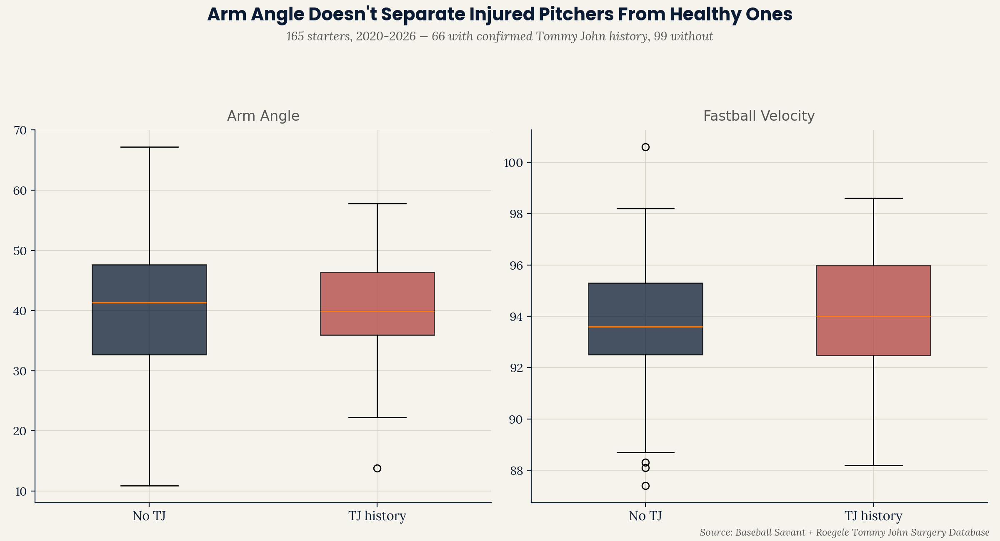

# Elbow Injury Risk — Empirical Validation

**[wheeler-workload-fatigue-study](https://github.com/ejimenezperformance/wheeler-workload-fatigue-study)
built a literature-based elbow torque proxy from arm angle alone,
estimating that Wheeler's mechanical redesign reduced his elbow load by
~6.6 Nm. This project tests that proxy against real Tommy John surgery
history across 165 MLB starters — and finds it doesn't hold up
empirically.**

Part of the [Emerson Performance](https://github.com/ejimenezperformance)
analytics portfolio (EP-TSP framework). This is Phase 3 of the Wheeler
line of work: Phase 1 established the mechanical redesign
(`wheeler-dri-case-study`), Phase 2 built a theoretical injury-risk proxy
(`wheeler-workload-fatigue-study`), and this phase validates that proxy
against real outcomes.

*[Versión en español disponible aquí](README.es.md)*

---

## The question

A literature-based proxy is only useful if it actually predicts real
outcomes. Does arm angle — the input to the torque proxy — differ
between pitchers who have had Tommy John surgery and those who haven't?

## Key finding



| Metric | No TJ History (n=99) | TJ History (n=66) |
|---|---|---|
| Arm angle | 40.5° | 40.6° |
| Fastball velocity | 93.7 mph | 94.0 mph |

**Arm angle shows essentially no separation between the two groups** —
a 0.1° difference that is not meaningfully different. Fastball velocity
is very slightly higher in the injured group (0.3 mph), a small
difference in the direction the literature would predict (harder
throwing → more UCL stress) but far too small, on its own, to serve as a
useful screening signal in this sample.

**This means the arm-angle-based torque proxy from
`wheeler-workload-fatigue-study` does not empirically distinguish
at-risk pitchers from healthy ones in this dataset.** The proxy was
always presented as a literature-based estimate, not a validated
predictor — this project is the validation step, and the result is
negative.

## Why this matters

This is a genuinely useful finding, not a wasted effort. It says: a
single mechanical variable (arm angle) — even when converted into a
physically-motivated torque estimate — is not sufficient to flag
elbow injury risk on its own. This is consistent with the broader
pattern across this portfolio (`league-arm-angle-study`,
`swing-plane-efficiency-study`, `pitch-consistency-contact-quality-study`):
isolated mechanical proxies rarely predict real outcomes cleanly. Real
injury-risk modeling would likely need cumulative workload history,
pitch-mix data, biomechanical variables beyond arm angle (elbow torque
measured directly, not estimated), and probably medical/training history
that isn't in any public leaderboard — exactly the kind of multi-source
approach `reading-a-slump` used successfully for a different question.

## Methodology: building the injury-history dataset

There is no single public, structured, complete database of every MLB
pitcher's Tommy John surgery history. This project consolidated three
source types:

1. **Wikipedia's "List of baseball players who underwent Tommy John
   surgery"** — cross-referenced by name against the 165 pitchers in
   `league-arm-angle-study`'s dataset.
2. **Targeted news searches** for specific well-known recent cases
   (e.g., Shane Bieber, Spencer Strider, Lucas Giolito) to confirm exact
   surgery dates.
3. **Jon Roegele's Tommy John Surgery Database** (a widely-cited,
   community-maintained spreadsheet referenced by academic literature,
   MLB.com, and SABR) — both its chronological surgery log (providing
   exact dates for 2025-2026 cases) and its year-by-year "team roster"
   tabs (2020-2024), which list every pitcher with Tommy John history who
   appeared for each team that season. Cross-referencing team-roster
   tabs for all six seasons (2020-2024) against precise-date entries
   (2025-2026) reached **saturation** — the final two years checked
   (2021, 2020) added zero new names, indicating the cross-reference had
   captured the full set of TJ-history pitchers present in this data
   source for the 165-pitcher pool.

This produced 66 of 165 pitchers (40%) with confirmed Tommy John
history — a rate consistent with published estimates of TJ surgery
prevalence among MLB pitchers, which is a reasonable internal
consistency check on the sample.

## Repo structure

```
elbow-injury-risk-validation/
├── data/
│   ├── pitching_full_2020_2026.csv
│   └── injury_list_full.csv
├── scripts/
│   ├── injury_validation_analysis.py
│   └── ep_chart_style.py
└── outputs/
    ├── injury_comparison_{EN,ES}.png
    └── per_pitcher_injury_comparison.csv
```

## Reproduce the analysis

```bash
git clone https://github.com/ejimenezperformance/elbow-injury-risk-validation.git
cd elbow-injury-risk-validation
pip install pandas matplotlib
python scripts/injury_validation_analysis.py
```

## Limitations

- **The injury-history dataset is a cross-reference against a
  community-maintained, admittedly incomplete public source** (Roegele's
  database explicitly describes itself this way, and academic literature
  citing it notes the same). "No TJ history found" means exactly that —
  not found in these sources — not a certainty that a pitcher never had
  the surgery.
- **This does not distinguish surgery timing relative to the arm-angle
  data used.** A pitcher's arm angle here reflects their first available
  season in the dataset (2020 or their debut year), which for some
  pitchers may be before their TJ surgery and for others after — this
  analysis does not separate "arm angle that preceded injury" from "arm
  angle after recovery and mechanical adjustment," which could dilute a
  real signal if one exists.
- **Small effect sizes were not tested for statistical significance**
  (e.g., a formal t-test or logistic regression) — the reported
  differences are descriptive, and given how small they are, are very
  unlikely to be significant regardless.
- **This tests one proxy (arm angle-based torque) against one outcome
  (any TJ history, ever).** It does not test whether arm angle predicts
  *when* an injury occurs, or test other candidate risk factors (workload,
  pitch mix, velocity trends) in combination.

## Contact

**Emerson Jiménez** — Strength & Conditioning Coach, Baseball Performance
Specialist. [Emerson Performance](https://github.com/ejimenezperformance) ·
[@emersonperformance](https://instagram.com/emersonperformance)

---

*EP-TSP framework and design © Emerson Performance. Statcast/Baseball
Savant data is public domain, non-commercial use. Tommy John surgery
history compiled from publicly available sources (Wikipedia, news
reporting, Jon Roegele's Tommy John Surgery Database).*
